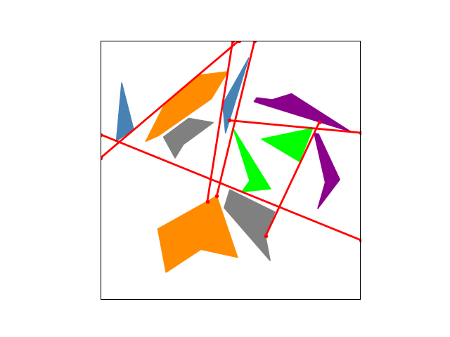
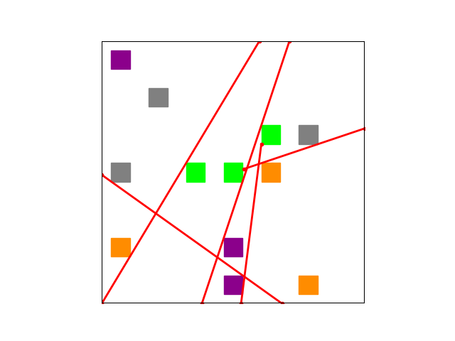
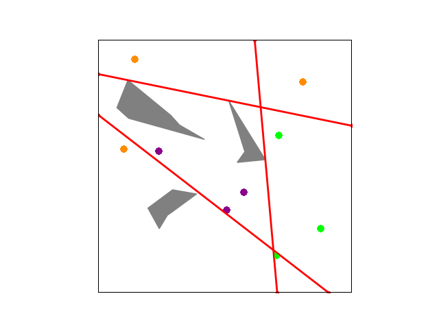
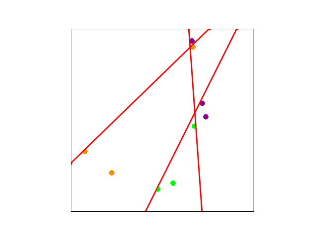

### Barrier Forming
This repository contains the implementation for solving the problem of separating multiple polygonal sets with the minimum number of line segments.

The evaluation and details of the algorithm is published at ICRA 2022 in a paper titled "Barrier Forming: Separating Polygonal Sets with Minimum Number of Lines" available at [arXiv](https://arxiv.org/pdf/2111.09151.pdf), and the presentation video is available at [youtube](https://www.youtube.com/watch?v=rln8M-7M9EI).

The main implementation uses Gurobi, and the link and include locations in the makefile need to be the locations as where Gurobi is installed.

To run the code for separating random polygons with random obstacles

```bash
$make all
$python gen_random.py
$python visualize.py
```

for separating cubes

```bash
$python gen_cube.py
$python visualize.py
```

for separating points with polygonal obstacles

```bash
$python gen_points_poly.py
$python visualize.py
```

for separating points

```bash
$python gen_points.py
$python visualize.py
```

Here are some example results of separating green, purple, orange, blue objects or points, with gray obstacles which do not matter.


